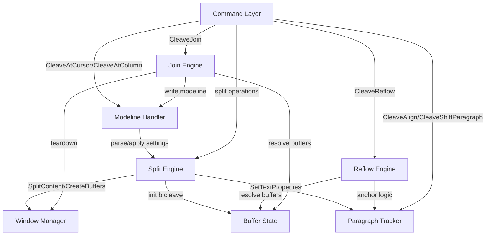
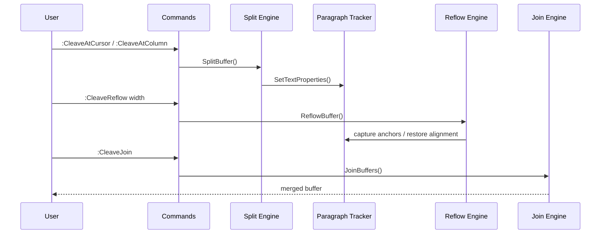

# vim-cleave Architecture Review

This document summarizes the architecture of vim-cleave, provides
function-by-function logic descriptions, and highlights opportunities to
improve code structure and maintainability.

## High-Level Architecture

vim-cleave is organized around a few core subsystems:

1. Command layer defines user-facing entry points.
2. Modeline handling reads and writes cleave-related settings from files.
3. Split engine creates left/right buffers based on a virtual column.
4. Window manager lays out and synchronizes the split view.
5. Paragraph tracker uses text properties and anchors to keep paragraphs
   aligned between buffers.
6. Reflow engine wraps text in either buffer while preserving alignment.
7. Join engine merges left/right buffers back into the original buffer.

## Diagram: Component Flow

## Diagram: Split/Reflow/Join Sequence

## Core State And Data Structures

1. `b:cleave` dict (stored on left/right buffers)
   - `original`: original buffer number
   - `side`: `left` or `right`
   - `peer`: opposite buffer number
   - `col`: split virtual column
2. `b:cleave_col_last` on the original buffer records the last split column
   for `:CleaveAgain`.
3. `b:cleave_reflow_mode` stores per-buffer reflow mode overrides.
4. `b:cleave_modeline_settings` stores applied modeline settings.
5. `g:cleave_*` globals configure default behavior.
6. Text properties of type `cleave_paragraph_start` annotate paragraph
   anchors in the left buffer when `+textprop` is available.

## File Layout

1. `plugin/cleave.vim`: user-facing commands.
2. `autoload/cleave.vim`: split/reflow/join logic, paragraph tracking,
   and window management.
3. `autoload/cleave/modeline.vim`: modeline parsing, inference, and
   persistence.
4. `ftplugin/left.vim`: syntax highlight of right margin in left buffer.
5. `ftplugin/right.vim`: syntax highlight of right buffer.
6. `doc/cleave.txt`: help documentation.
7. `test/`: automated test suite for splitting/reflow and multibyte cases.

## Function Reference

### `plugin/cleave.vim` (Command Definitions)

| Command | Logic |
| --- | --- |
| `:CleaveAtCursor` | Calls `cleave#SplitBuffer()` using cursor column. |
| `:CleaveAtColumn` | Calls `cleave#SplitBuffer()` using provided column. |
| `:CleaveAtColorColumn` | Calls `cleave#SplitAtColorcolumn()`. |
| `:CleaveAgain` | Calls `cleave#RecleaveLast()` using stored column. |
| `:CleaveUndo` | Calls `cleave#UndoCleave()` to discard split buffers. |
| `:CleaveJoin` | Calls `cleave#JoinBuffers()` to merge edits. |
| `:CleaveReflow` | Calls `cleave#ReflowBuffer()` with width and mode. |
| `:CleaveJustifyToggle` | Calls `cleave#ToggleReflowMode()`. |
| `:CleaveSetProps` | Calls `cleave#SetTextProperties()`. |
| `:CleaveAlign` | Calls `cleave#AlignRightToLeftParagraphs()`. |
| `:CleaveToggleTextAnchorVis` | Calls `cleave#ToggleParagraphHighlight()`. |
| `:CleaveShiftParagraphUp/Down` | Calls `cleave#ShiftParagraph()`. |
| `:CleaveDebug` | Calls `cleave#DebugParagraphs()`. |

### `autoload/cleave/modeline.vim`

| Function | Logic |
| --- | --- |
| `cleave#modeline#Mode()` | Returns `g:cleave_modeline` (default `read`). |
| `cleave#modeline#Parse(bufnr)` | Scans first/last 5 lines for `vim:` modeline
  and extracts cleave-relevant settings. |
| `cleave#modeline#Apply(settings)` | Validates and clamps modeline values to
  safe ranges and returns a normalized dict. |
| `cleave#modeline#Infer(bufnr)` | Derives settings from the buffer when no
  modeline is present (textwidth, wrapmargin, foldcolumn, colorcolumn).
  Defaults to `ve=all` and `cc=80`. |
| `cleave#modeline#Ensure(bufnr, settings)` | Writes a modeline back to the
  buffer when mode is `update`, then applies settings to Vim options. |
| `ApplySettingsToBuffer(bufnr, settings)` | Applies settings to
  `textwidth`, `wrapmargin`, window-local `colorcolumn`/`foldcolumn`, and
  global `virtualedit`. |
| `cleave#modeline#BuildString(settings, other_opts)` | Builds modeline string
  containing cleave settings plus any other options. |
| `ModelineRanges(total)` | Computes line numbers for modeline scanning:
  first 5 and last 5 lines. |
| `ParseModelineText(text)` | Parses a single line for `vim:` settings and
  returns cleave keys plus other options. |
| `Clamp(val, lo, hi)` | Clamps numeric values to a range. |
| `ValidateVe(val)` | Ensures `virtualedit` value is valid; falls back to
  `all`. |
| `InferTextwidth(bufnr)` | Estimates textwidth from average line length
  (capped at 79). |
| `InferFoldcolumn(bufnr)` | Estimates foldcolumn based on indent variance. |

### `autoload/cleave.vim`

#### Paragraph Detection Helpers

| Function | Logic |
| --- | --- |
| `IsParaStart(lines, idx)` | Returns true when a line is non-empty and is
  either the first line or preceded by a blank line. |
| `ParaStarts(lines)` | Returns 1-based line numbers of paragraph starts
  using `IsParaStart()`. |
| `ExtractParagraphs(lines)` | Returns paragraphs as a list of
  `{start, content}` using simple blank-line boundaries. |
| `BuildParagraphPlacement(paragraphs, target_line_numbers)` | Builds a
  new buffer by placing paragraphs at target lines, inserting blank lines
  and tracking actual placement when overlaps occur. |

#### Buffer And Window Helpers

| Function | Logic |
| --- | --- |
| `ReplaceBufferLines(bufnr, lines)` | Replaces buffer contents and removes
  any trailing excess lines. |
| `PadBufferLines(bufnr, target_len)` | Pads buffer with blank lines to a
  target length. |
| `PadRightToLeft(left_bufnr, right_bufnr)` | Ensures right buffer has at
  least as many lines as the left buffer. |
| `TeardownCleave(original, left, right)` | Restores original buffer,
  closes right window, deletes temp buffers, and re-focuses left window. |

#### Virtual Column Utilities

| Function | Logic |
| --- | --- |
| `cleave#VcolToByte(string, vcol)` | Converts a virtual column to a byte
  index, accounting for tabs and wide characters. |
| `cleave#ByteToVcol(string, byte_pos)` | Converts a byte position to a
  virtual column. |
| `cleave#VirtualStrpart(string, start_vcol, end_vcol)` | Returns a substring
  based on virtual columns, using `VcolToByte` and clamping to bounds. |

#### Buffer Resolution And Split Entry Points

| Function | Logic |
| --- | --- |
| `ResolveBuffers([bufnr])` | Resolves `[original, left, right]` from
  `b:cleave` on a given or current buffer. |
| `cleave#SplitBuffer(bufnr, ...)` | Validates buffer state, reads modeline,
  determines split column, applies modeline settings, and calls
  `SplitBufferAtCol()`. |
| `cleave#SplitAtColorcolumn()` | Parses `&colorcolumn` and splits at its
  first numeric value. |
| `cleave#ToggleReflowMode()` | Toggles per-buffer reflow mode between
  `ragged` and `justify`. |
| `ApplyModelineToBuffer(bufnr, settings)` | Applies modeline settings
  before splitting (textwidth, foldcolumn, gutter). |
| `SplitBufferAtCol(bufnr, cleave_col)` | Orchestrates the full split:
  extract lines, create buffers, set up windows, apply modeline window
  settings, set buffer state, store last column, and initialize text
  properties. |
| `cleave#RecleaveLast()` | Re-splits the current buffer using stored
  `b:cleave_col_last`. |
| `cleave#SplitContent(lines, cleave_col)` | Splits each line into left/right
  strings at a virtual column. |
| `cleave#CreateBuffers(left_lines, right_lines, original_name, fdc)` |
  Creates two `nofile` buffers, sets options, sets textwidth from longest
  line, and installs InsertLeave autocmds to sync paragraphs. |
| `cleave#SetupWindows(cleave_col, left_bufnr, right_bufnr, ...)` | Creates
  a vertical split, sizes the left window using virtual column width, sets
  scrollbind, and restores cursor position. |
| `cleave#UndoCleave()` | Closes split buffers without merging changes. |

#### Join Engine

| Function | Logic |
| --- | --- |
| `cleave#JoinBuffers()` | Reconstructs the original buffer by padding left
  lines to the split column, merges right lines, copies textwidth/foldcolumn,
  updates modeline settings, writes modeline if enabled, tears down split
  windows, and restores window-local options. |

#### Reflow Option Resolution

| Function | Logic |
| --- | --- |
| `NormalizeReflowMode(mode)` | Ensures mode is `ragged` or `justify`. |
| `CurrentReflowMode()` | Returns buffer override or global default. |
| `DefaultReflowOptions(width)` | Builds default options dict from globals. |
| `ResolveReflowOptions(width, mode_override)` | Applies overrides and
  validates mode. |
| `WithDefaultReflowOptions(options)` | Merges options with defaults,
  normalizes numeric fields, and clamps hyphenation length. |

#### Reflow Pipeline

| Function | Logic |
| --- | --- |
| `cleave#ReflowBuffer(...)` | Validates width, resolves buffers and side,
  then routes to `ReflowLeftBuffer()` or `ReflowRightBuffer()`. |
| `cleave#ReflowRightBuffer(options, current, left, right)` | Extracts
  paragraphs with original positions, reflows each paragraph (skipping
  headings and code fences), then rebuilds the buffer while preserving
  positions when possible. |
| `CaptureAnchors(left_lines, para_starts)` | Captures first-word
  anchors from left buffer paragraphs to track positions after reflow. |
| `LocateAnchorsAfterReflow(buffer_lines, anchors)` | Scans for anchors
  (skipping fenced code) to determine updated paragraph positions. |
| `ApplyPostReflowUi(new_width, current, right, right_lines, starts)` |
  Restores right-buffer alignment, updates stored split column, resizes the
  left window, updates textwidth, and refreshes text properties. |
| `cleave#ReflowLeftBuffer(options, current, left, right)` | Captures
  anchors from right buffer, reflows left buffer, locates updated anchors,
  restores right alignment, resizes UI, and pads right buffer. |
| `cleave#ReflowText(lines, options)` | Wraps text paragraph-by-paragraph,
  preserving headings and code fences, and returns the reflowed lines. |

#### Wrapping, Hyphenation, And Justification

| Function | Logic |
| --- | --- |
| `ExtractIndentAndHanging(line)` | Extracts base indent and hanging
  marker for bullets/numbered lists. |
| `NormalizeWrappingText(lines, dehyphenate)` | Trims and optionally
  dehyphenates line endings before wrapping. |
| `HyphenateWord(word, width, options)` | Splits long words on vowel
  boundaries to fit width (if enabled). |
| `JustifyLine(line, width)` | Inserts extra spaces across gaps to reach a
  target width. |
| `JustifyLines(lines, options, widths)` | Justifies each line except the
  last unless configured. |
| `cleave#WrapParagraph(paragraph_lines, options)` | Builds a wrapped
  paragraph preserving indentation and hanging indents, with optional
  justification and hyphenation. |

#### Textwidth And Paragraph Line Helpers

| Function | Logic |
| --- | --- |
| `cleave#SetTexwidthToLongestLine()` | Sets `textwidth` to the display
  width of the longest line in the current buffer. |
| `cleave#GetRightBufferParagraphLines()` | Returns paragraph starts from
  right buffer using simple detection. |
| `cleave#GetLeftBufferParagraphLines()` | Returns paragraph starts based
  on text properties in the left buffer, falling back to regeneration. |

#### Paragraph Alignment And Text Properties

| Function | Logic |
| --- | --- |
| `cleave#ToggleParagraphHighlight()` | Toggles the highlight group for
  paragraph anchor text properties and forces a redraw. |
| `cleave#PlaceRightParagraphsAtLines(target_lines)` |
  Rebuilds right buffer by placing paragraphs at target lines, sliding down
  to avoid overlap. Uses simple paragraph detection. |
| `cleave#AlignRightToLeftParagraphs()` | Reads text property positions,
  extracts right paragraphs (simple detection), places at anchors, pads,
  updates props, restores cursor, calls `syncbind`. |
| `cleave#ShiftParagraph(direction)` | Moves the current paragraph up or
  down by one blank line, enforcing single-line paragraph spacing. |
| `cleave#RestoreParagraphAlignment(right_bufnr, original_lines, starts)` |
  Rebuilds right buffer so paragraphs start at saved positions. |
| `cleave#SyncRightParagraphs()` | On InsertLeave in right buffer, pads
  buffer and refreshes text properties. |
| `cleave#SyncLeftParagraphs()` | On InsertLeave in left buffer, aligns right
  paragraphs to left anchors and refreshes properties. |
| `cleave#OnTextChanged()` | On TextChanged in right buffer, detects
  paragraph deletions by comparing count with stored `b:cleave_para_count`.
  Removes orphaned text properties and calls `CleaveAlign`. |
| `cleave#SetTextProperties()` | Adds `cleave_paragraph_start` properties to
  left buffer lines that correspond to paragraph starts in the right buffer.
  Stores paragraph count in `b:cleave_para_count`. |
| `cleave#DebugParagraphs([mode])` | Prints text properties and paragraph
  starts in interleaved or sequential format. |

### `ftplugin/left.vim`

This file does not define functions. It sets a `Note` syntax match to
highlight text beyond the desired left width (defaults to `&textwidth` plus
`&wrapmargin`) and links it to `Identifier`.

### `ftplugin/right.vim`

This file does not define functions. It highlights the entire right buffer
as `Note` linked to `LineNr` for a subdued visual style.

## Opportunities To Improve

1. Split `autoload/cleave.vim` into smaller modules (split/join, reflow,
   paragraph tracking, wrapping utilities) to reduce file size and improve
   navigability.
2. Store and restore window-local options (`scrollbind`, `colorcolumn`,
   `foldcolumn`) and global `virtualedit` to minimize side effects after
   `:CleaveJoin` or `:CleaveUndo`.
3. Unify paragraph extraction functions (`ExtractParagraphs*`) by
   parameterizing the boundary predicate to avoid duplication.
4. Centralize validation of cleave state (buffer triple resolution and
   side detection) to avoid repeated error messages and edge-case drift.
5. Record and restore original buffer options before applying modeline
   settings so the plugin can safely undo changes when requested.
6. Extend tests to cover `:CleaveUndo` and paragraph shifting boundaries,
   since these flows are heavy on buffer mutations.
7. Consider a minimal logging/debug facility controlled by a global toggle
   so alignment warnings can be captured without flooding the message area.
8. Provide explicit guards for unsaved changes in `CleaveAgain`, mirroring
   the safety check in `CleaveAtCursor`.

## Potential Refactors For Clarity

1. Introduce a `cleave#state#` namespace to encapsulate state resolution and
   mutation (`b:cleave`, last column, per-buffer settings).
2. Introduce a `cleave#paragraph#` namespace for paragraph detection and
   placement to reduce the cognitive load in reflow and sync routines.
3. Use a shared helper to apply window sizing and gutter math so the split
   column calculation is updated in one place.
4. Consider using a single "apply modeline" function shared by split and join
   operations to reduce duplicated settings logic.
