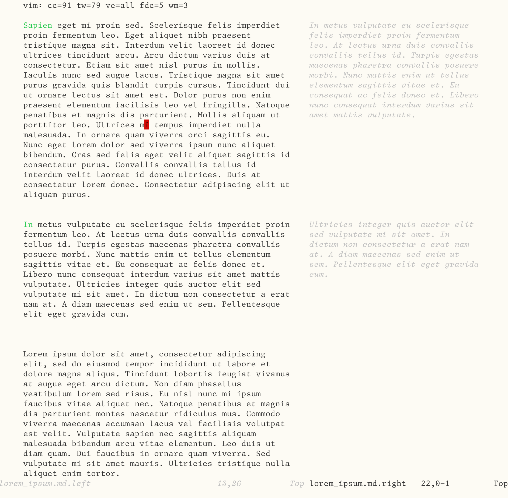

# vim-cleave
<p align="center">
  
</p>
Vim-cleave is a plugin that splits a buffer's content vertically at a specified column, creating separate left and right buffers while maintaining spatial positioning. It was developed as a way to bring the wonder of margin notes to plain text files. 

Quick demo:
[](https://asciinema.org/a/IIWD2CA3ZwNII12hTd5U3v7u1)
## Features

- **Buffer Splitting**: Split any buffer vertically at a specified column or use cursor position
- **Text Reflow**: Reflow text in either buffer while maintaining paragraph alignment, so can change the layout of of each column based on the screen real estate you have. 
- **Spatial Preservation**: Maintains cursor position and scroll synchronization.  Even when split, acts like a single document. 
- **Paragraph Alignment**: Intelligently preserves paragraph boundaries during reflow so if you change the main text the margin notes will stay aligned with the content they were added next to. 

## Installation

### Manual Installation

```bash
mkdir -p ~/.vim/pack/plugins/start
cd ~/.vim/pack/plugins/start
git clone https://github.com/mtwebb/vim-cleave.git
```

### vim-plug

```vim
Plug 'mtwebb/vim-cleave'
```

### Vundle

```vim
Plugin 'mtwebb/vim-cleave'
```

## Usage

### Basic Workflow

1. Open a file with content you want to split
2. Position cursor at desired split column
3. Run `:CleaveAtCursor` to create left and right buffers
4. Edit either buffer independently
5. Use `:CleaveReflow <width>` to reflow text while preserving alignment
6. Use `:CleaveJoin` to merge back to original format
7. Use `:CleaveUndo` to restore original buffer

### Commands

#### `:CleaveAtCursor`
Splits the current buffer at the cursor position. Creates two new buffers:
- Left buffer: content from start of each line to cursor column
- Right buffer: content from cursor column to end of each line

#### `:CleaveAtColumn <column>`
Splits the current buffer at the specified column number.

**Example:**
```vim
:CleaveAtColumn 80
```

#### `:CleaveUndo`
Restores the original buffer and closes the cleaved windows. This discards any changes made to the split buffers.

#### `:CleaveJoin`
Merges the left and right buffers back into the original buffer, maintaining proper alignment and spacing between the content. Changes are preserved.

#### `:CleaveReflow <width>`
Reflows the text in the current buffer (left or right) to the specified width. 

**Key features:**
- Automatically detects which cleaved buffer has focus
- Preserves paragraph alignment between buffers
- Maintains correspondence between left and right content
- Updates window sizing when reflowing the left buffer
- Minimum width: 10 characters

**Example:**
```vim
:CleaveReflow 60
```

#### `:CleaveAlign`
Aligns right buffer paragraphs to match left buffer paragraph positions. This command is useful when paragraph alignment has been disrupted and needs to be restored.

**Key features:**
- Uses text properties to identify paragraph positions in the left buffer
- Automatically creates text properties if they don't exist
- Handles paragraph overlap conflicts by sliding paragraphs down
- Maintains proper spacing between paragraphs
- Provides feedback on actual paragraph placement

**Example:**
```vim
:CleaveAlign
```

### Options

#### `g:cleave_gutter`
Sets the number of spaces between the left and right content when joining buffers. This affects the spacing calculation during `:CleaveJoin` operations.

**Default:** `3`

**Example:**
```vim
let g:cleave_gutter = 5
```

## Use Cases

- **Documentation Editing**: Split documentation with comments/annotations
- **Code Review**: Compare code side-by-side with notes
- **Diff Editing**: Work with unified diff files
- **Formatted Text**: Edit text with specific column layouts
- **Data Files**: Work with fixed-width data formats

## Requirements

- Vim 8.0 or higher
- Text properties support (for advanced paragraph alignment features)

## Contributing

Contributions are welcome! Please feel free to submit issues and pull requests.

## License

This project is licensed under the MIT License.
